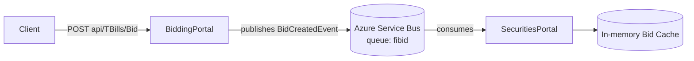

# Securities Bidding

A demo solution showing event-driven communication between two ASP.NET Core services using Azure Service Bus. Bidders submit Treasury Bill (T-Bill) bids through `BiddingPortal`; `SecuritiesPortal` consumes bid events asynchronously and maintains a running total per issue.

## Architecture



- **BiddingPortal**: Minimal API that accepts bid submissions and publishes a `BidCreatedEvent` message to the `fibid` Service Bus queue.
- **SecuritiesPortal**: Background hosted service that processes messages from the `fibid` queue and aggregates bid totals per T-Bill issue number.

## Projects

| Project | Description |
|---|---|
| `BiddingPortal` | Public-facing API for submitting T-Bill bids |
| `SecuritiesPortal` | Background consumer that tracks aggregate bid totals |

## Prerequisites

- .NET 10 SDK
- An Azure Service Bus namespace with a queue named `fibid`

## Configuration

Both projects read the Service Bus connection string from `ConnectionStrings:ServiceBus`. **Do not commit real credentials** — `appsettings.json` ships with an empty placeholder. Use .NET user-secrets locally:

```bash
dotnet user-secrets init --project BiddingPortal
dotnet user-secrets set "ConnectionStrings:ServiceBus" "<your-connection-string>" --project BiddingPortal

dotnet user-secrets init --project SecuritiesPortal
dotnet user-secrets set "ConnectionStrings:ServiceBus" "<your-connection-string>" --project SecuritiesPortal
```

Or set the `ConnectionStrings__ServiceBus` environment variable in each hosting environment.

## Running locally

```bash
dotnet run --project BiddingPortal
dotnet run --project SecuritiesPortal
```

## API

### `POST /api/TBills/Bid` (BiddingPortal)

Submits a new T-Bill bid.

**Request body:**
```json
{
  "issueNumber": "912796XXX",
  "amount": 10000,
  "Competitive": false
}
```

**Response:** `200 OK` with the generated bid ID (GUID).

## Message contract

`BidCreatedEvent` is published to the `fibid` queue:

```json
{
  "bidId": "guid",
  "issueNumber": "string",
  "facevalue": 0,
  "createdat": "datetime",
  "bidder": "string"
}
```

